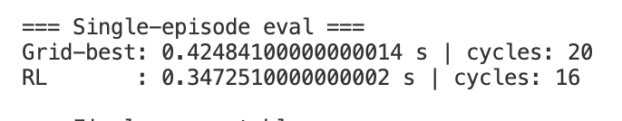

## Repository Layout

- `SolvePhase/hypre/`: vendored HYPRE source tree
- `SetupPhase/learning-setup/`: setup-phase tuning harnesses and native solver wrapper
- `SetupPhase/learning-setup/solver/`: Python wrapper plus the native runtime libraries used by the setup-phase scripts

## First Pull / Reproducible Local Environment

The repo is intended to be usable from a fresh clone without carrying around local CMake build trees or experiment output folders.

What should be in Git:

- source code
- the vendored HYPRE source tree
- the setup-phase Python code
- the Windows runtime libraries currently used by the setup-phase solver wrapper in `SetupPhase/learning-setup/solver/`
- the macOS native build helper in `SetupPhase/learning-setup/solver/build_macos_solver.sh`

What should stay out of Git:

- local `build/` directories
- generated CMake files
- experiment plots / CSVs / JSON summaries
- local macOS `.dylib` files, object files, import libraries, and other one-off native build artifacts

At the moment, the setup-phase Python wrapper loads a compiled shared library from:

- `SetupPhase/learning-setup/solver/libamg_setup_solver.dll` on Windows
- `SetupPhase/learning-setup/solver/libamg_setup_solver.dylib` on macOS

and expects the HYPRE runtime library alongside it. If you rebuild those native pieces locally, place the rebuilt library next to `boomeramg.py` or point `AMG_SETUP_SOLVER_LIB` at it.

## macOS Native Build (Setup Phase)

The macOS setup-phase solver is built locally from the vendored HYPRE source tree in `SolvePhase/hypre/`.

Prerequisites:

- Xcode Command Line Tools
- Homebrew `cmake`
- Homebrew `open-mpi`

One-time local build:

```bash
./SetupPhase/learning-setup/solver/build_macos_solver.sh
```

This produces local runtime files in `SetupPhase/learning-setup/solver/`:

- `libamg_setup_solver.dylib`
- `libHYPRE.3.0.0.dylib`

The script builds HYPRE into repo-local `build/` directories, stages the macOS dylibs, and keeps the Windows runtime path untouched.

## Dependencies (Solve Phase)

The following Python packages are required:

- numpy  
- gymnasium  
- stable-baselines3  
- torch  
- matplotlib  
- tensorboard  

## Running the Solve Phase

1. Navigate to `SolvePhase/Hypre/src/test/`.
2. recompile if needed
3. Run the training script:

```bash
python train_ppo.py
```



*Figure: Current solve phase progress.*
