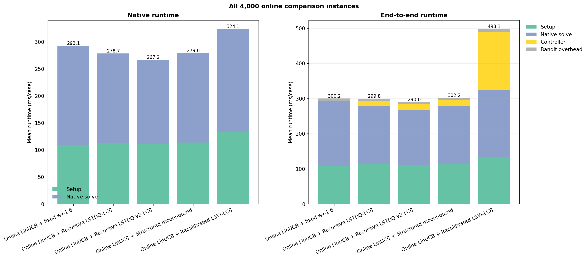
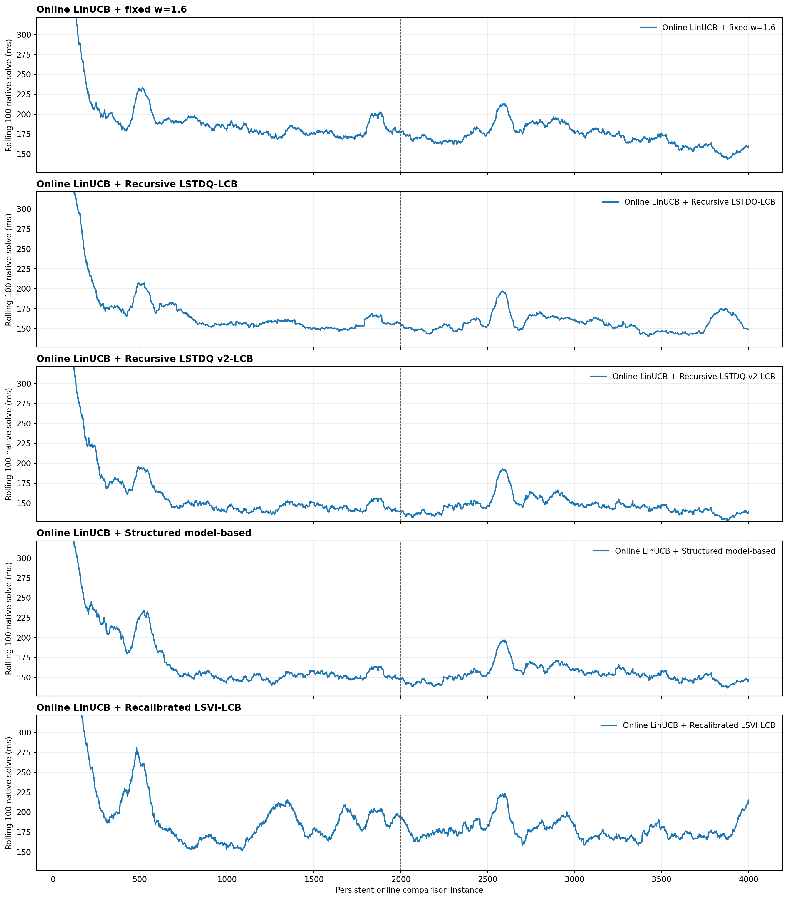

# 60³ / 4K Solve-Controller Screening: Final Report

## Executive conclusion

On the locked canonical 4K joint-online stream, **Recursive LSTDQ v2-LCB is
the only candidate that produces a statistically clear end-to-end improvement
over Online LinUCB + fixed `w=1.6`**.

- Fixed `w=1.6`: **300.183 ms/case** end to end.
- Recursive LSTDQ v2-LCB: **290.001 ms/case** end to end.
- Improvement: **3.39%**, paired-bootstrap 95% CI **[2.42%, 4.28%]**.
- Total saving over 4,000 cases: **40.73 s**.
- All 122 primary failures were recovered; there were no unrecovered failures.

This screen selects LSTDQ v2 as the candidate for multi-seed and held-out
matrix-family validation. It does not yet establish a paper-level generalization
claim because the final screen uses one locked stream and one seed configuration.

## Locked protocol and audit

- Stream SHA-256:
  `156e6fdbbed6733d98e2c5f7e550e5d230c45217d0833ac64567563b5434459b`.
- Grid: `60³`; 4,000 instances; setup resolution `20`; `max_cycles=50`.
- Solve action grid: `1.00:0.05:3.00`.
- Every method used an independent Online LinUCB state, learned continuously
  from scratch, and saw the same instance order.
- LSTDQ v2 used the independently selected `beta=4`; recalibrated LSVI used
  `beta=1`. These values were frozen before the canonical screen.
- Each trajectory contains exactly 4,000 records, and each method has 4,000
  committed LinUCB updates and zero unrecovered failures.
- Per-record native and end-to-end runtime identities hold exactly.
- All 4K randomized method-order records contain one complete permutation of
  the five locked methods.
- Four controller checkpoints were saved at 1K intervals plus a final state;
  all five final LinUCB mutable states were saved.

## All-4K ranking

All entries are means in milliseconds per case. Positive improvement means
faster than Online LinUCB + fixed `w=1.6`.

| Rank | Method | Setup | Native solve | Controller | Bandit | End-to-end | E2E improvement (95% CI) |
|---:|---|---:|---:|---:|---:|---:|---:|
| 1 | Recursive LSTDQ v2-LCB | 111.252 | 155.983 | 16.072 | 6.694 | **290.001** | **+3.39% [2.42, 4.28]** |
| 2 | Recursive LSTDQ v1-LCB | 112.915 | 165.745 | 14.211 | 6.909 | 299.780 | +0.13% [-0.85, 1.12] |
| 3 | Fixed `w=1.6` | 108.715 | 184.372 | 0.000 | 7.095 | 300.183 | baseline |
| 4 | Structured model-based | 113.824 | 165.748 | 15.671 | 6.940 | 302.184 | -0.67% [-1.52, 0.23] |
| 5 | Recalibrated LSVI-LCB | 134.218 | 189.859 | 166.598 | 7.416 | 498.091 | -65.93% [-84.17, -50.16] |

## Where the LSTDQ v2 saving comes from

Relative to fixed `w=1.6`, LSTDQ v2 changes the measured components as follows:

- Setup runtime is **2.33% slower**: +10.15 s over the stream.
- Native solve runtime is **15.40% faster**: -113.56 s.
- Native setup-plus-solve time is **8.82% faster**: -103.41 s.
- Controller execution adds **64.29 s**, or 16.07 ms/case.
- Solve plus controller remains **6.68% faster**, 95% CI
  **[5.61%, 7.67%]**.
- LinUCB overhead is 1.60 s lower in this execution.
- The net end-to-end saving is therefore **40.73 s (3.39%)**.

The primary result is deliberately joint and dynamic: the solve controller
changes the cost feedback observed by its independent setup learner, so setup
and solve trajectories co-adapt. The slower average setup component shows that
the final advantage is not caused by LSTDQ v2 receiving an easier setup stream;
its solve-time reduction is large enough to dominate both setup variation and
controller overhead.

## Direct LSTDQ v2 versus LSTDQ v1 comparison

The two variants use the same recursive LSTDQ mean update. They differ in the
confidence construction, beta, and their resulting online trajectories.

Across all 4,000 paired instances, v2 versus v1 gives:

- Native solve: **5.89% faster**, 95% CI **[4.76%, 6.99%]**.
- Native total: **4.10% faster**, 95% CI **[3.00%, 5.18%]**.
- Solve plus controller: **4.39% faster**, 95% CI **[3.07%, 5.74%]**.
- End to end: **3.26% faster**, 95% CI **[2.12%, 4.41%]**.

The current v2 implementation does **not** reduce controller overhead: it costs
16.07 ms/case versus 14.21 ms/case for v1. Its performance gain comes from a
better learned solve trajectory, not from a cheaper controller implementation.
Profiling and optimizing the v2 coverage/MAD hot path remains worthwhile, but
any changed implementation must be evaluated as a new experiment rather than
retroactively altering this locked result.

## Dynamic adaptation

End-to-end improvement of LSTDQ v2 versus fixed `w=1.6` by consecutive 1K
blocks is:

| Cases | Fixed E2E | LSTDQ v2 E2E | Improvement |
|---|---:|---:|---:|
| 1–1,000 | 351.735 | 352.352 | -0.18% |
| 1,001–2,000 | 283.981 | 264.090 | +7.00% |
| 2,001–3,000 | 294.277 | 282.581 | +3.98% |
| 3,001–4,000 | 270.739 | 260.981 | +3.60% |

The first 1K contains the common from-scratch setup-learning transient. After
that transient, v2 remains faster in every 1K block. In the last 500 cases it is
**2.75% faster than fixed**, 95% CI **[1.93%, 3.59%]**, and **8.03% faster than
v1**, 95% CI **[5.10%, 11.60%]**. It has zero primary failures in the last 500.

## Interpretation of the other candidates

### Recursive LSTDQ v1-LCB

V1 reduces native solve time by 10.10%, but its slower setup trajectory and
14.21 ms/case controller cost consume almost all of that saving. Its all-4K
end-to-end interval crosses zero, and it is 5.74% slower than fixed in the last
500. It remains a useful algorithmic baseline but is not the selected method.

### Structured model-based controller

The structured model also reduces native solve time by 10.10%. After its
15.67 ms/case controller cost and a 4.70% slower setup component, its end-to-end
result is statistically tied with fixed over all 4K and 2.02% slower in the last
500. The physical progress model is viable, but this implementation does not
convert its solve improvement into joint wall-clock improvement.

### Recalibrated LSVI-LCB

The hierarchical LSVI variant is not competitive in this online systems
regime. Its controller cost grows from 69.62 ms/case in the first 1K to
258.64 ms/case in the last 1K as repeated refits process the accumulated
transition history. It also develops a worse joint setup trajectory and records
426 recovered primary failures. The present stagewise/batch architecture should
not proceed to the expensive multi-seed paper experiment without a fundamentally
different bounded-cost update scheme.

## Confidence diagnostics and naming caveat

- V1 raw sandwich uncertainty averages 11.43 ms; empirical error coverage is
  50.2% / 70.9% / 89.4% at 1x / 2x / 4x.
- V2 raw MAD-scaled coverage width averages only 0.838 ms; empirical coverage is
  6.2% / 11.7% / 20.8% at 1x / 2x / 4x. Its median absolute TD error is 12.78
  times the reported raw width.

Consequently, v2's quantity currently functions as a useful **coverage-based
exploration scale**, but the 4K evidence does not justify describing it as a
well-calibrated statistical confidence interval. This distinction should be
preserved in the paper unless a separate calibration procedure is added and
validated.

## Same-setup audit limitation

Because every method owns an independent Online LinUCB learner and receives
controller-dependent loss feedback, exact setup matches with the fixed branch
are rare: 28–34 cases for the learned controllers (0.7–0.85%), all in the first
half, and none in the last 2K. Those early coincident cases are selection-biased
and too few to estimate mature controller effects. The same-setup audit is kept
as a protocol check, but it cannot replace the primary same-instance joint
comparison or support a pure solve-controller causal claim.

For pure controller attribution, a future fixed-setup replay should compare v1
and v2 with identical setup and exploration randomness. For the deployed goal,
however, the joint end-to-end result is the relevant system-level metric.

## Decision and next validation

1. Carry **Recursive LSTDQ v2-LCB** forward as the sole finalist.
2. Do not tune this canonical 4K result after inspection.
3. Run multiple seeds and held-out matrix families before making the paper's
   generalization claim.
4. Include a fixed-setup, matched-randomness v1/v2 replay as a mechanism audit.
5. Profile the v2 decision/update hot path and validate any optimized version
   independently.

## Artifacts

- Detailed window tables and confidence diagnostics: [`screen_report.md`](screen_report.md)
- Machine-readable result: [`result.json`](result.json)
- Full summary CSV: [`summary_4000.csv`](summary_4000.csv)
- Same-setup audit: [`same_setup_audit.json`](same_setup_audit.json)
- Reproduction command: [`reproduce.sh`](reproduce.sh)
- Generated figure index: [`plot_summary.json`](plot_summary.json)
